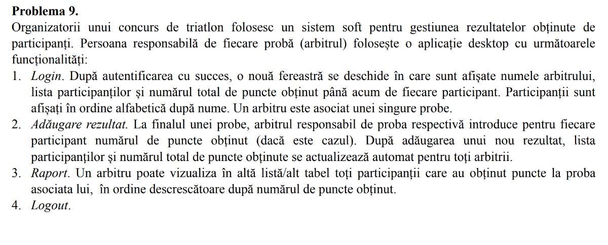

# 📟MPP folder

   - **[Lab1](Lab1)** - creeaza o diagrama pentru o baza de date SQL a problemei date (*problema 9*)
   - **[Lab3](Lab3)** - creeeza clase si interfete pentru problema primita ( [C#](Lab3/C%23) and [Java](Lab3/java) )
   - **[Lab4](Lab4)** - creeaza metodele claselor alese ( cele folositoare [cerintei](Problema9.png) ) , jurnalizare si conectarea la baze de date prin string ( 
     [C#](Lab4/) and [Java](Lab4/)
